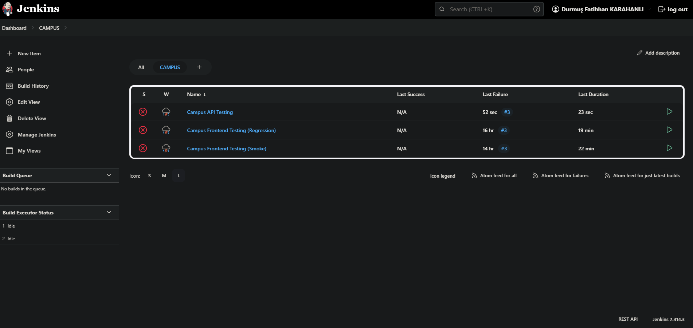

# mersys.io API Testing using REST Assured


[](https://choosealicense.com/licenses/mit/)

This project is created to perform API tests for mersys.io, an educational application, with the aim of enhancing user experience.


While Starting
---------------
### The simplest method :
-  ***Follow the path***
      * File > New > Project From Version Control

  -  ***Copy URL and paste***
    
-  ***Open this project at your IDE***
   * ***Select JDK version for project***
       * jdk1.8 
   *  ***To load the POM with Maven,click on***
       * pom.xml > Maven > Reload Project 





### Dependencies


<div align="right">
  <table style="width: 100%; table-layout: fixed; border-collapse: collapse; height: 100%;">
    <thead>
      <tr>
        <th style="width: 33.33%;"></th>
        <th style="width: 33.33%;"></th>
        <th style="width: 33.33%;"></th>
      </tr>
      <tr>
        <td style="width: 33.33%;">A Java library designed for comprehensive REST API testing, providing a robust open-source testing framework.</td>
        <td style="width: 33.33%;">TestNG is a powerful open-source testing framework for Java that can be used to efficiently automate a wide range of testing tasks and scenarios.</td>
        <td style="width: 33.33%;">A Java library dedicated to data matching and assertion, assisting in ensuring data integrity and consistency.</td>
      </tr>
    </thead>
    <tbody>
      <tr>
        <th style="width: 33.33%;"></th>
        <th style="width: 33.33%;"></th>
        <th style="width: 33.33%;"></th>
      </tr>
      <tr>
        <td style="width: 33.33%;">A Java library specialized in the processing of JSON data, simplifying data manipulation and transformation tasks.</td>
        <td style="width: 33.33%;">An extension of Apache POI optimized for modern Office document formats, enhancing compatibility and performance in document operations.</td>
        <td style="width: 33.33%;">A Java library tailored for seamless handling of Microsoft Office documents, offering functionality for document management.</td>
      </tr>
      <tr>
	<th style="width: 33.33%;"></th>
        <td style="width: 66.67%;" colspan="2">JavaFaker is a versatile and user-friendly Java library that provides realistic fake data for use in project development, testing, and presentations.</td>
      </tr>
    </tbody>
  </table>
</div>


### File Structure


```text
├── src
│   └── test
│       └── java
│           ├── Campus_API_Testing
│           │   └── API Testing Classes files 
│           ├── ExcelFiles
│           │   └── LoginInfo.xlsx
│           ├── Utilities
│           │   └── ExcelManager
│       
├── Test Excel Reports
│   └── ExcelOutput.xlsx
├── .gitignore
└── pom.xml
```

### TEAM


- <h4>T.Lead <| Burhan SENGUL <br /><strong> <a href="mailto:burhseng@gmail.com"> </a></strong></h4>
- <h4>Tester <| Şeyma KADO <br /><strong> <a href="mailto:4seyma@gmail.com"> </a>&nbsp;</strong></h4>
- <h4>Tester <| D. Fatihhan KARAHANLI <br /><strong> <a href="mailto:fatihhan.karahanli@gmail.com"> </a></strong></h4>
- <h4><strong>Tester <| Ramazan INCE </strong><br /><strong><a href="mailto:inceliramazan80@gmail.com"></a>&nbsp;</strong></h4>
- <h4>Tester <| Zafer CANSIZ <br /><strong><a href="mailto:zfrcnsz1@gmail.com"></a>&nbsp;</strong></h4>


### TODO


* It's crucial to stick to the specified dependencies versions to maintain compatibility and reliability.
  Using different versions can jeopardize project stability and compatibility.
  In case you encounter problems with alternative versions, please note that these
  issues cannot be attributed to the project.<br>
  <br>
* If you experience issues or compatibility problems with a specific version of our project or
  if you are tempted to use different versions, we encourage you to provide feedback. We will
  do our best to assist you.

### LICENSE


- This project is an open-source software licensed under the terms of the[ MIT license](https://opensource.org/license/mit/).

